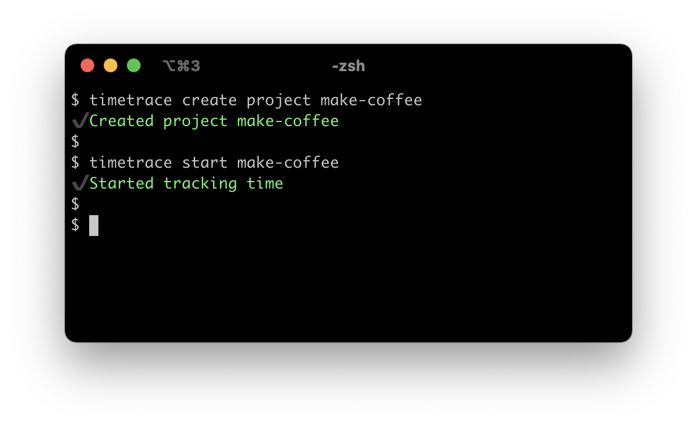

<h1>:alarm_clock: timetrace
<a href="https://circleci.com/gh/dominikbraun/timetrace"></a>
<a href="https://www.codefactor.io/repository/github/dominikbraun/timetrace"></a>
<a href="https://github.com/dominikbraun/timetrace/releases"></a>
<a href="LICENSE"></a>
</h1>

> timetrace is a simple CLI for tracking your working time.



## Installation

### Homebrew

```
brew tap dominikbraun/timetrace
brew install timetrace
```

### Docker

```
docker container run -v ${HOME}:/data dominikbraun/timetrace
```

### Binary

Download the [latest release](https://github.com/dominikbraun/timetrace/releases)
and extract the binary into a directory like `/usr/local/bin` or
`C:\Program Files\timetrace`. Make sure the directory is in the `PATH` variable.

## Usage example

First, create a project you're working for:

```
timetrace create project make-coffee
```

Once the project is created, you're able to track work on that project.

```
timetrace start make-coffee
```

You can obtain your currently worked time using `timetrace status`. When you've
finished your work, stop tracking:

```
timetrace stop
```

You're also able to delete and edit projects and records (see below).

## Command reference

### Create a project

**Syntax:**

```
timetrace create project <KEY>
```

**Arguments:**

|Argument|Description|
|-|-|
|`KEY`|An unique project key.|

**Example:**

Create a project called `make-coffee`:

```
timetrace create project make-coffee
```

### Get a project

**Syntax:**

```
timetrace get project <KEY>
```

**Arguments:**

|Argument|Description|
|-|-|
|`KEY`|The project key.|

**Example:**

Display a project called `make-coffee`:

```
timetrace get project make-coffee
```

### Get a record

**Syntax:**

```
timetrace get record <YYYY-MM-DD-HH-MM>
```

**Arguments:**

|Argument|Description|
|-|-|
|`YYYY-MM-DD-HH-MM`|The start time of the desired record.|

**Example:**

By default, records can be accessed using the 24-hour format, meaning 3:00 PM is
15. Display a record created on May 1st 2021, 3:00 PM:

```
timetrace get record 2021-05-01-15-00
```

This behavior [can be changed](#prefer-12-hour-clock-for-storing-records).

### List all projects

**Syntax:**

```
timetrace list projects
```

**Example:**

List all projects stored within the timetrace filesystem:

```
timetrace list projects
+---+-------------+
| # |     KEY     |
+---+-------------+
| 1 | make-coffee |
| 2 | my-website  |
| 3 | web-shop    |
+---+-------------+
```

### Edit a project

**Syntax:**

```
timetrace edit project <KEY>
```

**Arguments:**

|Argument|Description|
|-|-|
|`KEY`|The project key.|

**Example:**

Edit a project called `make-coffee`:

```
timetrace edit project make-coffee
```

### Delete a project

**Syntax:**

```
timetrace delete project <KEY>
```

**Arguments:**

|Argument|Description|
|-|-|
|`KEY`|The project key.|

**Example:**

Delete a project called `make-coffee`:

```
timetrace delete project make-coffee
```

### Start tracking

**Syntax:**

```
timetrace start <PROJECT KEY>
```

**Arguments:**

|Argument|Description|
|-|-|
|`PROJECT KEY`|The key of the project.|

**Flags:**

|Flag|Short|Description|
|-|-|-|
|`--billable`|`-b`|Mark the record as billable.|

**Example:**

Start working on a project called `make-coffee` and mark it as billable:

```
timetrace start --billable make-coffee
```

### Print current status

**Syntax:**

```
timetrace status
```

**Example:**

Print the current tracking status:

```
timetrace status
+-------------+--------------------+---------------+
|   PROJECT   | WORKED SINCE START | WORKED TODAY  |
+-------------+--------------------+---------------+
| make-coffee | 3h25m29.037343s    | 7h22m49.5749s |
+-------------+--------------------+---------------+
```

### Stop tracking

**Syntax:**

```
timetrace stop
```

**Example:**

Stop working on your current project:

```
timetrace stop
```

### Print version information

**Syntax:**

```
timetrace version
```

**Example:**

Print your installed timetrace version:

```
timetrace version
```

## Configuration

You may provide your own configuration in a file called `config.yaml` within
`$HOME/.timetrace`.

### Prefer 12-hour clock for storing records

If you prefer to use the 12-hour clock instead of the default 24-hour format,
add this to your `config.yaml` file:

```yaml
use12hours: true
```

This will allow you to [view a record](#get-a-record) created at 3:00 PM as
follows:

```
timetrace get record 2021-05-14-03-00PM
```

### Set your preferred editor

By default, timetrace will open the editor specified in `$EDITOR` or fall back
to `vi`. You may set your provide your preferred editor like so:

```yaml
editor: nano
```

## Credits

This project depends on the following packages:

* [spf13/cobra](https://github.com/spf13/cobra)
* [spf13/viper](https://github.com/spf13/viper)
* [fatih/color](https://github.com/fatih/color)
* [olekukonko/tablewriter](https://github.com/olekukonko/tablewriter)
* [enescakir/emoji](https://github.com/enescakir/emoji)